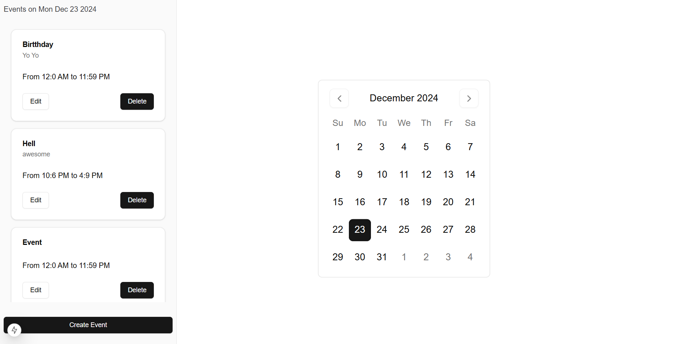

# Event Calendar App

A modern event calendar built with **Next.js 15**, **React 19**, and **Shadcn**. The app allows users to view, add, edit, and delete events on specific dates using an intuitive calendar interface.



## Features

- **View Events**: Display events on a calendar interface.
- **Add Events**: Add events to a specific date.
- **Edit Events**: Modify details of existing events.
- **Delete Events**: Remove events from the calendar.

## Getting Started

### Prerequisites

- Node.js (version 14 or above)
- npm (Node Package Manager)

### Clone the Repository

Clone the repository to your local machine using the following command:

```bash
git clone https://github.com/SUMExXx/event-calendar
```

### Install Dependencies

Navigate to the project directory and install the required dependencies:

```bash
cd event-calendar
npm install --legacy-peer-deps
```

### Run the Application Locally

To start the development server and run the app locally:

```bash
npm run dev
```

The app will be available at [http://localhost:3000](http://localhost:3000).

## Deployed App

You can view the live version of the app at the following link:
[View Deployed Event Calendar](https://event-calender-gilt.vercel.app/)

## Technologies Used

- **Next.js 15** - Framework for building the app.
- **React 19** - Frontend library.
- **Shadcn** - Component library for UI styling.
- **LocalStorage** - Uses browser local storage for caching data.

---
Made with ❤️ by Suman Debnath
